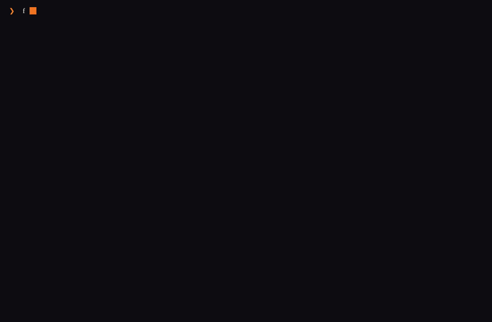
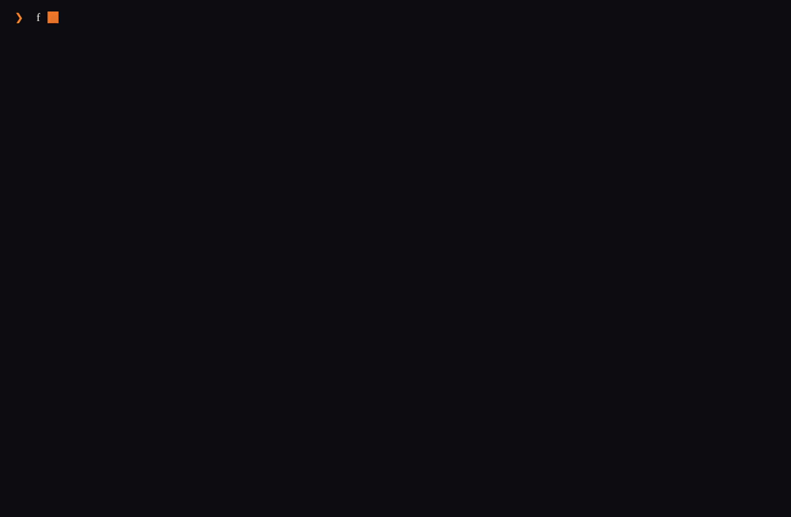

# festival

Interactive Festival manager — install, update, and browse `camp`, `fest`, and
plugins with a fire-themed TUI. CLI subcommands remain for scripts and agents.

> *A festival has a lot of different things going on, just like you.*

## Demo

Recorded against a real `./bin/festival` binary (VHS + PTY).

**Home — boot splash, ambient flame, multi-activity booths, menu → doctor**

<p align="center">
  
</p>

**Tour — install channel picker, shell/PATH, installed list**

<p align="center">
  
</p>

Reproduce locally:

```bash
just build
just vhs all   # requires vhs, ttyd, ffmpeg
```

## Status

Private incubation in `obey-installer` (Go module still
`github.com/Obedience-Corp/obey-installer`). The public command name is
**`festival`**. The mature engine will later ship with the public Festival
distribution; until then `projects/festival` remains the public bootstrap
(npm/Homebrew/`install.sh`).

### Security (important)

Package metadata is currently consumed **without mandatory signature
verification.** Transport is HTTPS-only, git is hardened, and archive extraction
is bounded. Wiring mandatory verification is tracked by festival
`obey-installer-security-OI0007`. Treat installs as trusting the source
repository.

## Quick start (humans)

```bash
just build          # → bin/festival  (+ bin/obey-installer alias)
./bin/festival      # opens the TUI on a terminal
```

The TUI home screen lets you:

- Install / update the Festival suite (camp + fest)
- List installed packages
- Browse the catalog and install plugins
- Uninstall receipt-owned packages
- Manage marketplaces
- Run doctor and PATH / shell-init guidance

**Animations:** boot splash, ambient multi-activity “booths”, progress flame, and
a short success burst. Disable ambient motion with:

```bash
export FESTIVAL_REDUCED_MOTION=1
```

## CLI (scripts / agents)

```bash
festival install festival --channel stable
festival update festival
festival list
festival list --json
festival browse --product fest --kind plugin
festival marketplace list
festival doctor
festival shell-init zsh
festival which camp --show-all
festival version
```

JSON envelopes use schema version `festival/v1alpha1`.

### Install targets

| Target | Effect |
| --- | --- |
| `festival`, `camp`, `fest` | Install the suite bundle `obedience-corp/festival` (camp + fest) |
| `camp-<name>`, `fest-<name>` | Install a plugin from registered marketplaces |

## Home directory

| Env | Role |
| --- | --- |
| `FESTIVAL_HOME` | Preferred absolute path for manager state (wins if set) |
| `OBEY_INSTALLER_HOME` | Legacy alias |

Default: `~/.obey/installer` with `bin/`, `state.db`, marketplace clones, receipts.

## Development

```bash
just                  # list recipes
just build            # bin/festival
just run version
just check            # fmt + vet + lint + test
just test
just release all      # cross-platform festival-{os}-{arch}
```

### Layout

```text
cmd/festival/          # binary entry (bare → TUI, subcommands → CLI)
internal/app/          # service layer shared by CLI and TUI
internal/cli/          # cobra wrappers + human/JSON rendering
internal/tui/          # bubbletea manager (theme, anim, screens)
```

## What works under the hood

| Package | Surface |
| --- | --- |
| `internal/state` | SQLite + WAL, home, config |
| `internal/state/receipts` | Install receipts |
| `internal/state/lock` | Cross-process install lock |
| `internal/verify` | Canonical JSON + ed25519 (not yet mandatory on live path) |
| `internal/artifacts` | HTTPS download, bounded tar.gz, atomic move |
| `internal/source` | Marketplace clone cache + package index |

## Design reference

- **Festival Hub (control plane / launchpad / getting started):**  
  `workflow/design/festival-hub-control-plane/` in the campaign workspace — product contract, planes, and how the hub launches camp/fest TUIs then returns without relaunching `festival`.
- Marketplace architecture: `workflow/design/dungeon/completed/2026-06-08/festival-plugin-marketplace/`
- Brand fire colors: fest.build flame logo `#F2721C` / `#EA5513`
